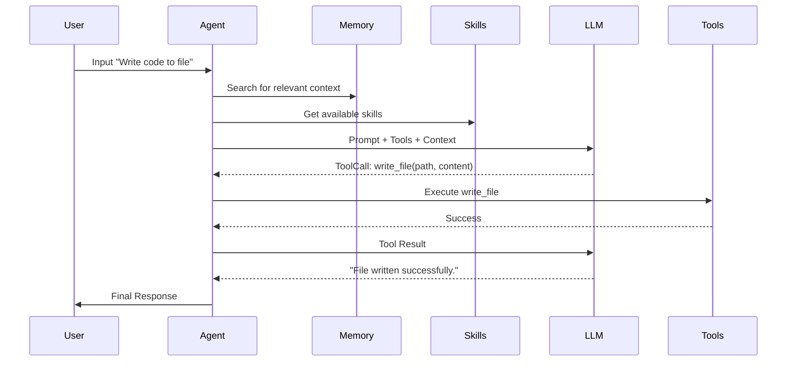

# Hermes Agent Architecture ☤

This document describes the internal design and control flow of the Hermes Agent .NET implementation.

## 1. Core Agent Loop (`IAgent`)

The heart of the system is the `HermesAgentLoop`. It follows a classic synchronous orchestration pattern:

1.  **Context Assembly**: Build the system prompt using `ISystemPromptBuilder`, combining the "SOUL" (persona), persistent memory, user profile, and available skills.
2.  **LLM Call**: Send the conversation history + tool definitions to the configured `ILlmProvider`.
3.  **Streaming Processing**: As the LLM responds, the loop captures text deltas and tool call deltas.
4.  **Tool Execution**: If tool calls are detected, the agent pauses generation, executes the tools (often in parallel), appends the results to the history, and loops back to step 2.
5.  **Finalization**: Once the LLM provides a final text response without tool calls, the session is saved via `ISessionManager`.

## 2. Memory & Persistence

Hermes uses a tiered memory approach:

### Short-term Memory (Conversation Context)
Managed in-memory via the `Conversation` object. To prevent context window overflow, the `IContextCompressor` (Sliding Window) summarizes older parts of the conversation once a token threshold is reached.

### Mid-term Memory (Session History)
Managed by `ISessionManager`. All messages, tool calls, and results are persisted.
- **File Implementation**: Stores sessions as JSON files in `~/.hermes/sessions/`.
- **SQLite Implementation**: Uses a relational schema for messages and an **FTS5 (Full Text Search)** virtual table for lightning-fast cross-session retrieval.

### Long-term Memory (Vector/Keyword)
Managed by `IMemoryStore`. This is used for facts the agent explicitly chooses to "remember" via the `save_memory` tool.
- Uses `bm25` ranking in SQLite for relevance-based search.

## 3. Skills (The "Self-Improving" Loop)

Skills are procedures stored in Markdown format (following the [agentskills.io](https://agentskills.io) standard).

- **Discovery**: During a conversation, the agent can be "nudged" to create a skill if it identifies a complex repeatable pattern.
- **Storage**: `ISkillManager` persists these to `~/.hermes/skills/`.
- **Injection**: Relevant skill descriptions are injected into the system prompt of future sessions, effectively increasing the agent's capabilities without changing its code.

## 4. Multi-Project Structure

- **HermesAgent.Core**: Pure abstractions and models. Zero external dependencies.
- **HermesAgent.Agent**: The logic of the loop and LLM integrations.
- **HermesAgent.Tools**: The implementation of various capabilities (File IO, Browser, etc.).
- **HermesAgent.Memory / Skills**: Implementation of the persistence layers.
- **HermesAgent.Web**: Exposes the agent via a standard REST API.
- **HermesAgent.Gateway**: Bridge between the Agent and messaging platforms (Telegram/Discord).
- **HermesAgent.Cli**: The main entry point for local human interaction.

## 5. Control Flow Diagram

